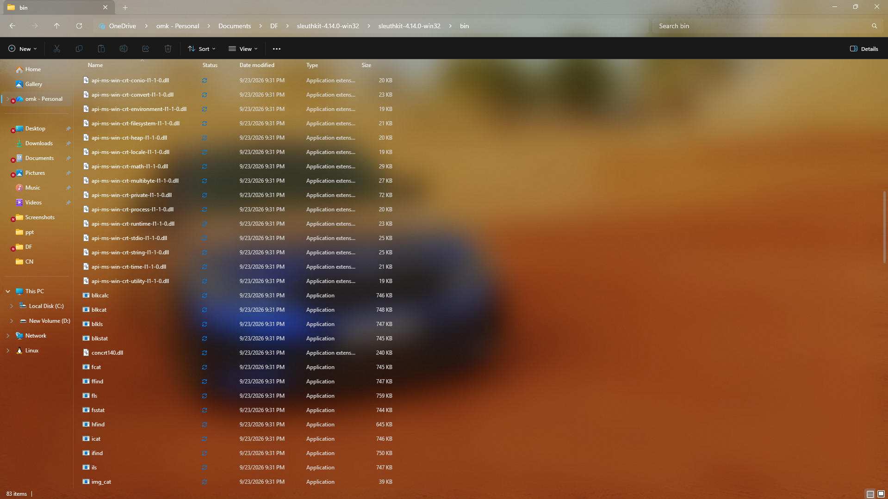
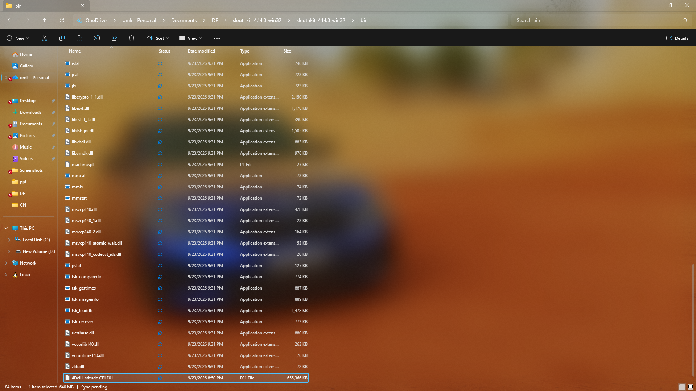
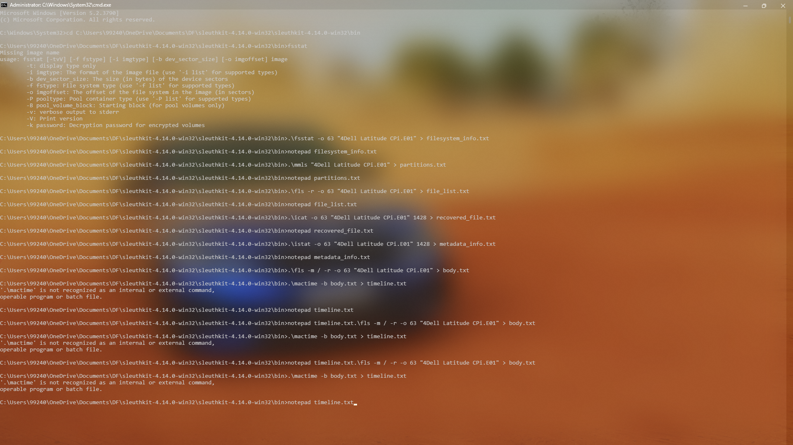
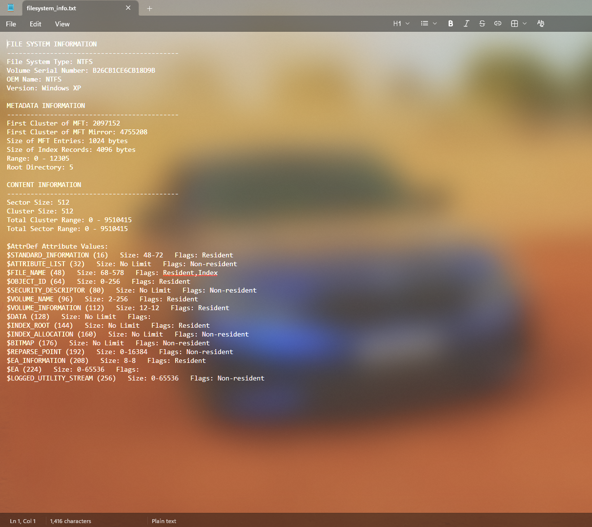
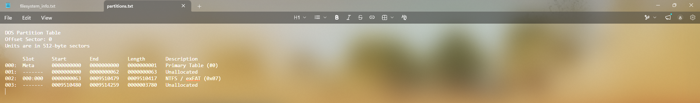
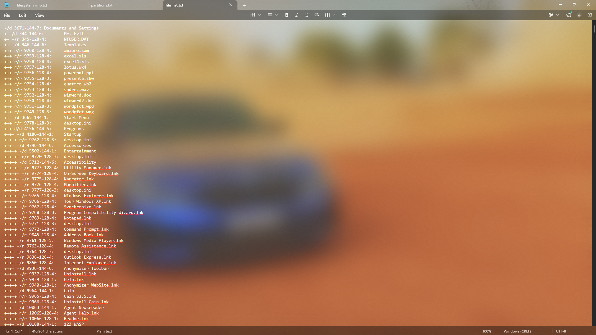
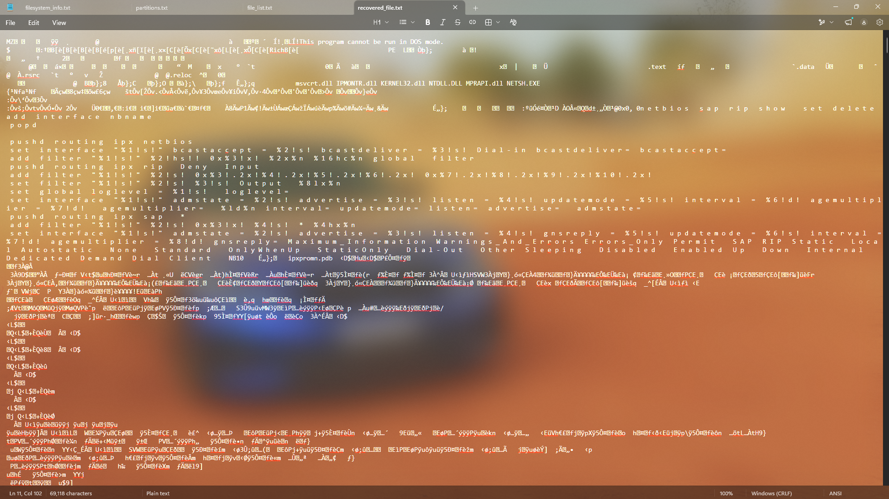
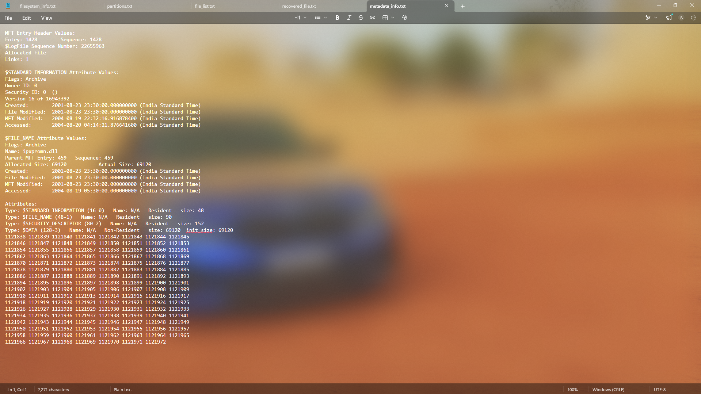

# 🔎 Sleuth Kit: Digital Evidence Analysis & Recovery

> **Experiment 6** | Digital Forensics Lab  
> *Comprehensive guide to analyzing disk images and recovering digital evidence using Sleuth Kit*

---

## 📋 Table of Contents
- [⚙️ Installation](#installation)
- [📊 File System Analysis](#file-system-analysis)
- [🔍 Evidence Recovery](#evidence-recovery)
- [📈 Timeline Analysis](#timeline-analysis)
- [📋 Report Generation](#report-generation)

---

## ⚙️ Installation


### Download & Install

1. **Download Sleuth Kit:**
   - Visit [Sleuth Kit Official](https://www.sleuthkit.org/)
   - Or use: [Google Drive Link](https://drive.google.com/drive/u/1/folders/1ilSFY7Tqn2L7AjQGhq8yJ8kixc_xTU-v)

2. **Install on Windows:**
   - Run installer
   - Add to system PATH
   - Verify: Open CMD → `tsk_version`

**Sleuth Kit Binaries Directory:**



**Available Sleuth Kit Tools:**



---

## 📊 File System Analysis

### Step 1️⃣ Get File System Info

```bash
fsstat [image_file] > filesystem_info.txt
```

**Sleuth Kit Commands Execution:**



**Output includes:**
- File system type (NTFS, FAT32, ext4, etc.)
- Block size & total blocks
- Inode information
- Journal details

**Filesystem Information Output:**



---

### Step 2️⃣ List Partitions

```bash
mmls [image_file] > partitions.txt
```

**Partition Table Analysis:**



**Displays:**
- Partition table structure
- Offset & size of each partition
- Partition types (Primary, Extended, etc.)

---

### Step 3️⃣ Recursive File Listing

```bash
fls -r [image_file] > file_list.txt
```

**Complete File System Listing:**



**Output contains:**
- Complete directory structure
- File metadata (size, timestamps)
- Deleted files (marked with * prefix)
- Inode numbers for recovery

| Flag | Purpose |
|------|---------|
| `-r` | Recursive listing |
| `-m` | Bodyfile format (for timeline) |
| `-p` | Include parent directory info |

---

## 🔍 Evidence Recovery

### Recover Deleted Files

```bash
icat [image_file] [inode_number] > recovered_file.dat
```

**Recovered File Content:**



**Process:**
1. Find inode in `file_list.txt`
2. Use `icat` to extract file content
3. Redirect to output file
4. Analyze recovered data

**Example:**
```bash
icat disk.E01 1234 > recovered_document.doc
```

---

### View File Metadata

```bash
istat [image_file] [inode_number] > metadata_info.txt
```

**File Metadata Analysis:**



**Metadata includes:**
- File size & allocated status
- MAC times (Modified, Accessed, Changed)
- Ownership & permissions
- Link count & references

---

## 📈 Timeline Analysis


### Generate Body File

```bash
fls -m / -r [image_file] > body.txt
```

### Create Timeline

```bash
mactime -b body.txt > timeline.txt
```

**Timeline shows:**
- Chronological file activity
- Modified, Accessed, Changed times
- Suspicious patterns & anomalies
- User behavior reconstruction

---

## 📋 Report Generation

### Compile Findings

**Output files to review:**
- `filesystem_info.txt` → Structure
- `partitions.txt` → Layout
- `file_list.txt` → File inventory
- `metadata_info.txt` → Details
- `timeline.txt` → Activity history
- Screenshots of recovered files

### Report Template

```
Investigation Report - Experiment 6
─────────────────────────────────
1. Evidence Information
   - Image: [filename]
   - MD5/SHA1: [hashes]
   
2. File System Analysis
   - Type & structure
   - Partitions identified
   
3. Evidence Found
   - Deleted files recovered
   - Suspicious files located
   
4. Timeline Findings
   - Key events & dates
   - User activity patterns
   
5. Conclusions
   - Summary of findings
```

---

## ✅ Best Practices

- [ ] Verify image integrity (hashes match)
- [ ] Analyze on **separate system** from source
- [ ] Document all **inode numbers** used
- [ ] Preserve **chain of custody**
- [ ] Use **write-blockers** for live devices
- [ ] Backup all **output files**
- [ ] Screenshot **key findings**

---

## 📚 References

- 🔗 [Sleuth Kit Official](https://www.sleuthkit.org/)
- 📖 [TSK Tools Manual](https://www.sleuthkit.org/sleuthkit/man/)
- 🎓 [NIST Digital Forensics Guidelines](https://www.nist.gov/publications/guidelines-evidence-preservation-and-examination-digital-evidence)

---

<div align="center">

**📌 Lab:** Digital Forensics | **Ex. No:** 6  
**Tool:** Sleuth Kit (TSK) | **Date:** 2026

</div>
