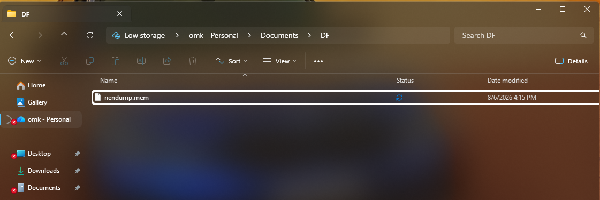

# 🔍 FTK Imager: Digital Forensics Investigation Tool

> **Experiment 1** | Digital Forensics Lab  
> *A comprehensive guide to capturing and analyzing forensic evidence using FTK Imager*

---

## 📋 Table of Contents
- [⚡ Acquiring Volatile Memory (RAM)](#acquiring-volatile-memory-ram)
- [💾 Acquiring Non-Volatile Memory (Disk)](#acquiring-non-volatile-memory-disk)
- [📚 References](#references)

---

## ⚡ Acquiring Volatile Memory (RAM)


> 💡 **Why RAM?** Volatile memory contains running processes, network connections, and temporary data crucial for forensic investigation.

### 📥 Installation
```
📦 FTK Imager 4.7.3.81 (x64)
```
**[Download Installer →](https://d1kpmuwb7gvu1i.cloudfront.net/Imgr/4.7.3.81%20Release/Exterro_FTK_Imager_%28x64%29-4.7.3.81.exe)**

---

### 🎯 Step-by-Step Capture Process

#### **Step 1️⃣ Run as Administrator**
```
⚙️ Required: Administrative Privileges
```
- Open FTK Imager with elevated permissions
- **Right-click** → **Run as administrator**

> ⚠️ **Important:** Without admin privileges, you cannot access system memory.

---

#### **Step 2️⃣ Initiate Memory Capture**

Navigate to the main menu:
```
File → Capture Memory
```


---

#### **Step 3️⃣ Configure Destination & Options**

A configuration dialog will appear. Set the following parameters:

| Parameter | Setting | Details |
|-----------|---------|---------|
| **Destination Path** | External Drive | Select a USB/external storage (NOT system drive) |
| **Filename** | `memdump.mem` | Default name or custom descriptive name |
| **Include pagefile.sys** | ✅ Optional | Captures virtual memory from disk |
| **Create AD1 file** | ✅ Optional | AccessData container format |

**Visual Configuration:**


---

#### **Step 4️⃣ Initiate Capture**

Click **`Capture Memory`** button to start acquisition.


---

#### **Step 5️⃣ Monitor Progress & Completion**

The capture process begins with a live progress indicator:

- 📊 **Progress Bar** shows real-time acquisition status
- ⏱️ **Time Duration** depends on total system RAM
- ✅ **Status Messages** confirm each phase


Once complete, your **memdump.mem** file is ready for analysis!

---

## 💾 Acquiring Non-Volatile Memory (Disk Image)


> 💡 **Why Disk Images?** Creates a bit-for-bit forensically sound copy of storage devices for detailed analysis and evidence preservation.

### 🎯 Disk Imaging Steps

#### **Step 1️⃣ Start the Imaging Process**

Navigate to:
```
File → Create Disk Image
```

---

#### **Step 2️⃣ Select Source Evidence Type**

Choose the type of data source to image:

| Source Type | Description |
|-------------|-------------|
| **Physical Drive** 💿 | Entire disk including all partitions, unallocated space, MBR |
| **Logical Drive** 📁 | Specific partition only (e.g., C: drive) |
| **Image File** 🔄 | Convert or copy existing image files |
| **Folder Contents** 📂 | Image specific folder only |


---

#### **Step 3️⃣ Select the Source Drive**

From the dropdown menu:
- Choose the physical drive to image
- Must be connected via **write-blocker** (critical for evidence integrity)
- Click **Finish**

> ⚖️ **Legal Requirement:** Write-blockers prevent accidental modification of source evidence.

---

#### **Step 4️⃣ Configure Image Destination**

Click **Add** in the "Create Image" window to define:


**Image Format Options:**

| Format | Advantages | Use Case |
|--------|-----------|----------|
| **E01 (EnCase)** ✅ | Compression, metadata, error-checking | Recommended for most cases |
| **Raw (DD)** | Bit-for-bit copy, universal | Compatibility, simplicity |


---

#### **Step 5️⃣ Evidence Information & Destination**

**Fill in Case Details:**
- 📝 Case number
- 👤 Examiner name
- 📋 Description

> This metadata is stored in the image for chain of custody documentation.

**Configure Destination:**
- **Must be different drive** from source
- **Example naming:** `Case001_SuspectHDD_2026-08-06`
- **Fragment Size:** Set 0 for single file (or split into parts if needed)

---

#### **Step 6️⃣ Start Imaging & Verification**

Before starting:
- ✅ Check **"Verify images after they are created"**
- This calculates hash values (MD5/SHA1) for integrity verification
- Click **Start**


**Imaging Duration:** Depends on drive size (can take several hours for large drives)

---

#### **Step 7️⃣ Completion & Hash Verification** ✨

Once finished, FTK Imager displays:

- **MD5 Hash:** Image fingerprint (128-bit)
- **SHA1 Hash:** Image fingerprint (160-bit)
- **Source Hash:** Original drive hash
- **Image Hash:** Copy hash


**Your Memory Dump File:**



> ✅ **Matching hashes confirm:** The forensic image is an exact, unmodified copy of the source drive.

---

## 🔐 Best Practices Checklist

- [ ] Always use **write-blocker** for physical drives
- [ ] Capture **volatile memory first** (RAM before shutdown)
- [ ] Document **examiner information** in metadata
- [ ] Verify **hash values** match after imaging
- [ ] Store images on **separate secure storage**
- [ ] Maintain **chain of custody** documentation
- [ ] Create **backup copies** of critical evidence

---

## 📚 References

- 🔗 [FTK Imager Official Website](https://accessdata.com/product-download/ftk-imager-version-4-5)
- 📖 [FTK Imager Documentation](https://accessdata.com/guides)
- 🎓 [NIST Guidelines - Digital Forensics](https://www.nist.gov/publications/guidelines-evidence-preservation-and-examination-digital-evidence)

---

<div align="center">

**📌 Last Updated:** August 6, 2026  
**👨‍💻 Experiment 1 - Digital Forensics Lab**

</div>
