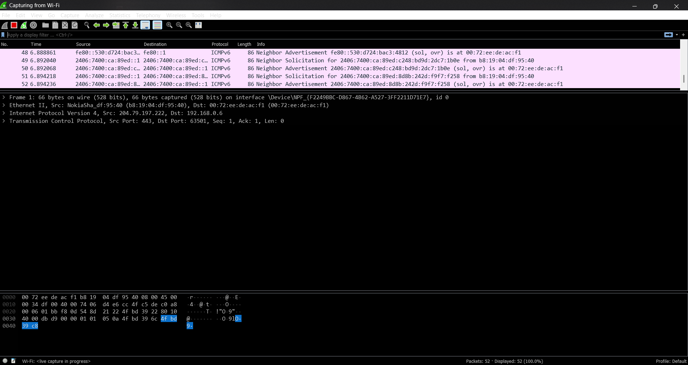
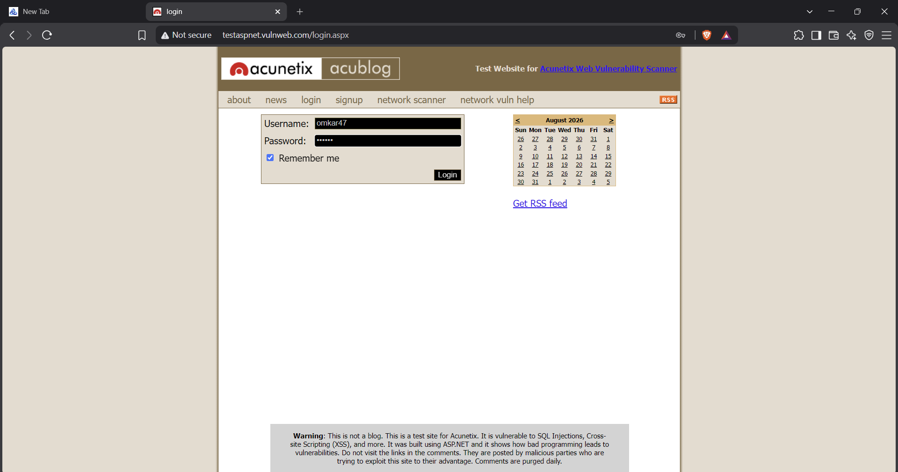
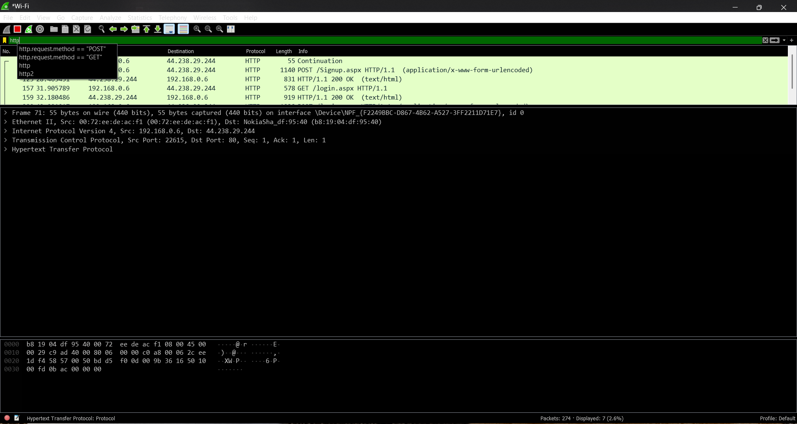
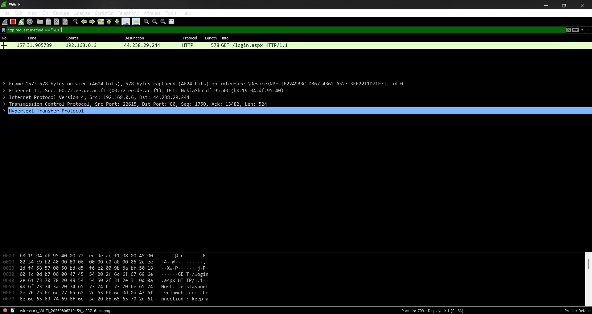
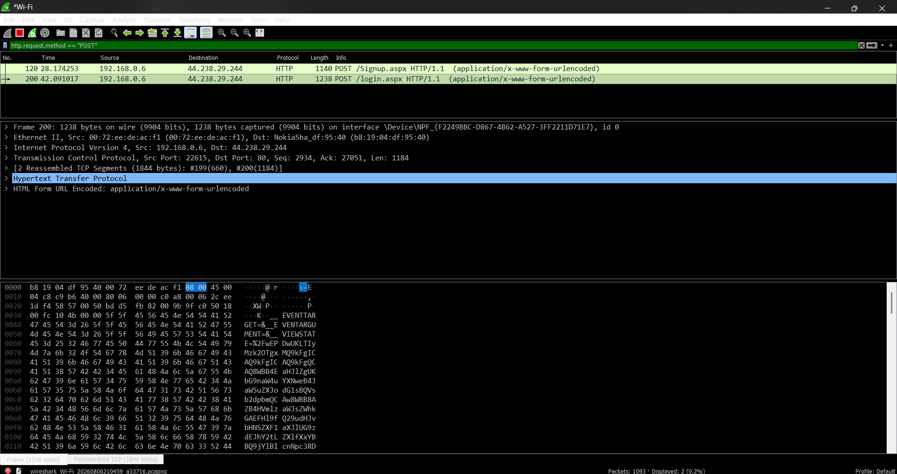

# 🔐 Wireshark: Password Capturing & Network Packet Analysis

> **Experiment 3** | Digital Forensics Lab  
> *Master the art of capturing and analyzing network credentials using Wireshark packet sniffer*

---

## 📋 Table of Contents
- [⚡ Introduction to Password Capturing](#introduction-to-password-capturing)
- [🎯 Step-by-Step Password Capture Guide](#step-by-step-password-capture-guide)
- [🔍 HTTP Protocol Analysis](#http-protocol-analysis)
- [📚 References](#references)

---

## ⚡ Introduction to Password Capturing


### 🚨 What Can Wireshark Capture?

Wireshark is a powerful network protocol analyzer capable of capturing:

| Data Type | Examples | Protocol |
|-----------|----------|----------|
| **Passwords** | Login credentials | HTTP, FTP, Telnet |
| **Usernames** | Account identifiers | HTTP, SMTP |
| **Email Addresses** | User contact info | SMTP, IMAP, POP3 |
| **Personal Information** | Credit cards, SSN, etc. | Various unsecured protocols |
| **Session Data** | Cookies, tokens | HTTP |

> 💡 **Why This Matters:** As long as network traffic can be captured, Wireshark can sniff passing passwords transmitted over unencrypted protocols.

### ⚖️ Legal & Ethical Considerations

> ⚠️ **Warning:** While captured data can help troubleshoot network problems, it can also be used **maliciously to gain unauthorized access** to sensitive information.

**This guide is for educational and authorized testing purposes only.**

---

## 🎯 Step-by-Step Password Capture Guide

### **Step 1️⃣ Launch Wireshark & Start Capturing**

```
Environment: Windows / Linux Virtual Machine
```

**Actions:**
- Open **Wireshark** application
- Select network interface to monitor (e.g., Wi-Fi adapter)
- Click **Start Capturing** button 🟢
- Monitor will begin capturing all network packets



> 💡 **Tip:** If capturing wireless traffic, ensure you have appropriate permissions on the network interface.

---

### **Step 2️⃣ Login to Website While Capturing**

**Objective:** Generate login packets to capture

**Process:**
1. While Wireshark is capturing, navigate to target website
2. Enter login credentials (username & password)
3. Submit login form
4. Complete authentication process

**Example Login Page:**
```
URL: testphp.vulnweb.com/login.php
Username: Tonystark_44
Password: tony@1234
```



> 📌 **Important:** Wireshark captures all traffic, including form submissions. Our credentials are now in the captured packets.

---

### **Step 3️⃣ Stop Capture & Begin Analysis**

**After successful login:**
- Click the **Stop Capturing** button 🛑
- Review captured packet list
- Prepare for credential extraction

---

### **Step 4️⃣ Apply HTTP Filter**


**Objective:** Isolate HTTP traffic from all captured packets

**Filter Command:**
```
http
```

**Where to Apply:**
- Locate **Display Filter** bar (top of packet list, typically shows green)
- Type filter command
- Press **Enter** to apply

**Result:**
- Display shows only HTTP protocol packets
- Dramatically reduces noise from other protocols (DNS, ARP, TCP, etc.)



---

### **Step 5️⃣ Identify Form Data Packets**


**Challenge:** Among HTTP packets, find the **form submission data**

### Two Methods for Form Submission

| Method | Use Case | Data Location |
|--------|----------|---------------|
| **GET** 📤 | Query parameters | URL visible in plaintext |
| **POST** 📥 | Form body data | Hidden in packet payload |

---

### **Step 6️⃣ Filter for GET Method**

**Filter Command:**
```
http.request.method == "GET"
```

**Expected Result:**
- Shows login page request (two packets typically)
- **BUT:** No form data in GET requests
- Credentials NOT visible with this method

**Why?** GET requests only request the page, they don't submit form data.



---

### **Step 7️⃣ Filter for POST Method** 🎯

**Objective:** Find actual credential submission

**Filter Command:**
```
http.request.method == "POST"
```

**Expected Result:**
- Identifies the specific packet containing form submission
- This packet carries the **username and password data**



---

## 🔍 HTTP Protocol Analysis

### **Packet Structure Breakdown**

When you select a POST packet containing form data, Wireshark shows:

```
Hypertext Transfer Protocol
├── GET /login.php HTTP/1.1
├── Host: testphp.vulnweb.com
├── User-Agent: Mozilla/5.0 (Windows NT 10.0; Win6)
├── Accept: text/html,application/xhtml+xml
├── Cache-Control: max-age=0
├── Connection: keep-alive
└── [REQUEST BODY - Contains Form Data]
```

---

### **Credential Extraction**

**Look for:** `HTML Form URL Encoded` section

**Typical Structure:**
```
Form item: "uname" = "omkar47"
Form item: "pass" = "[Hidden Plaintext]"
```

**What This Means:**
- `uname` = Username field  
- `pass` = Password field  
- Credentials are transmitted in **PLAINTEXT** over HTTP (not HTTPS)  
- **Anyone on the network can read these credentials!** 🚨

**Real Example from Your Capture:**
```
Username: omkar47
Password: Visible in packet payload (if HTTP)
Transmission: Unencrypted HTTP POST request
Risk Level: CRITICAL - Credentials exposed to network eavesdropping
```

---

## 📊 Complete Workflow Summary

```
Step 1: Launch Wireshark
    ↓
Step 2: Start Packet Capture
    ↓
Step 3: Login to Website with Credentials
    ↓
Step 4: Stop Capture
    ↓
Step 5: Apply Filter: http
    ↓
Step 6: Check GET Method (http.request.method == "GET")
    ↓
Step 7: Check POST Method (http.request.method == "POST")
    ↓
Step 8: Extract Form Data from POST Packet
    ↓
✅ Credentials Captured!
```

---

## 🔐 Security Insights

### Why Credentials Get Captured:

| Factor | Impact | Solution |
|--------|--------|----------|
| **HTTP vs HTTPS** | HTTP transmits plaintext | Use HTTPS encryption |
| **Network Position** | Anyone on network can sniff | Use VPN for security |
| **Protocol Design** | Legacy protocols lack encryption | Upgrade to secure alternatives |
| **Access Controls** | No authentication on capture | Implement network security |

### 🛡️ Defense Mechanisms:

- ✅ **Always use HTTPS** (encrypted HTTP)
- ✅ **Enable VPN** on public networks
- ✅ **Use password managers** with encrypted storage
- ✅ **Enable 2FA** (Two-Factor Authentication)
- ✅ **Monitor network** for unauthorized sniffing

---

## 📚 References

- 🔗 [Wireshark Official Documentation](https://www.wireshark.org/docs/)
- 📖 [HTTP Protocol RFC 7231](https://tools.ietf.org/html/rfc7231)
- 🎓 [Network Security Best Practices - NIST](https://csrc.nist.gov/)
- 🔐 [OWASP - Sensitive Data Exposure](https://owasp.org/www-project-top-ten/)

---

## ⚡ Quick Reference - Filter Commands

```
# Basic Protocol Filters
http                    → All HTTP traffic
http && ip.src == 192.168.1.1  → HTTP from specific IP
http.request.method == "GET"    → GET requests only
http.request.method == "POST"   → POST requests only
http.request.uri ~ "login"      → Requests containing "login"

# Advanced Filters
http.response.code == 200       → Successful responses
http.cookie                     → Packets with cookies
tcp.port == 80                  → Port 80 (HTTP) traffic
```

---

<div align="center">

**📌 Last Updated:** August 6, 2026  
**👨‍💻 Experiment 3 - Digital Forensics Lab**  
**⚠️ Educational Purpose Only**

</div>
