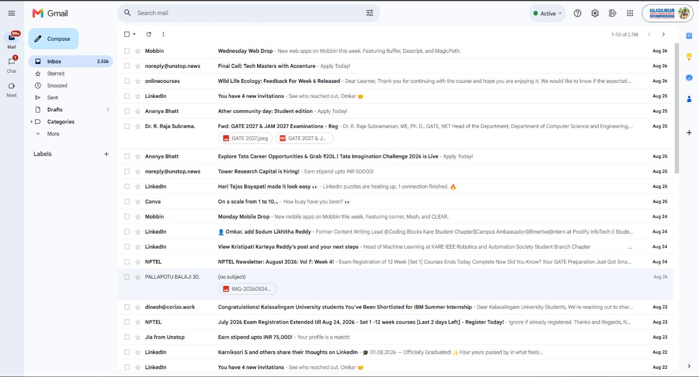
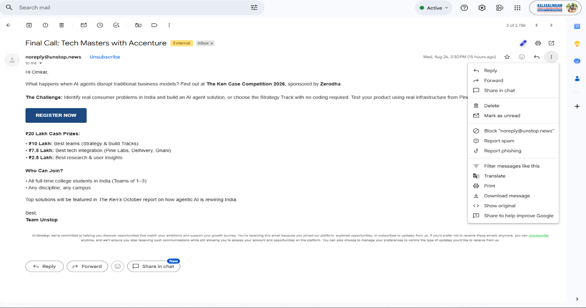
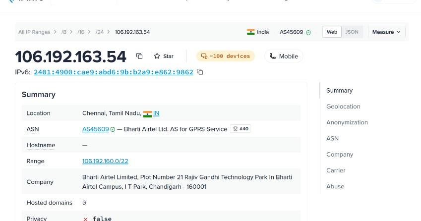
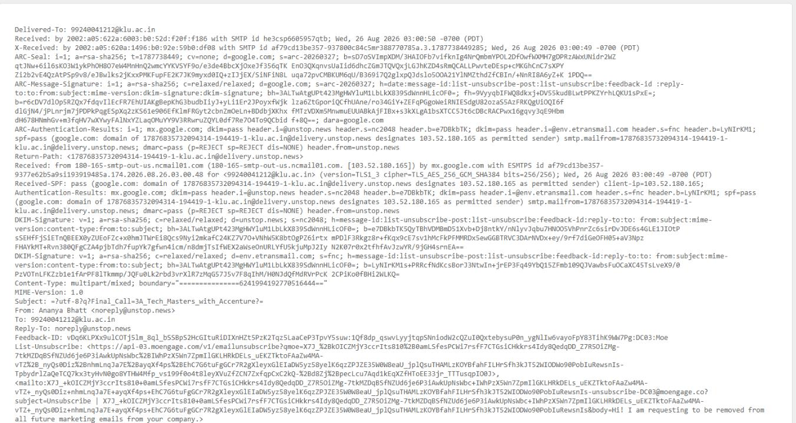
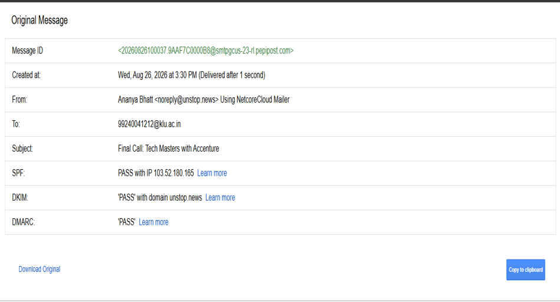
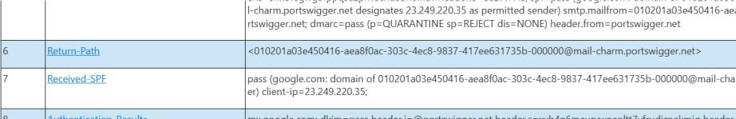
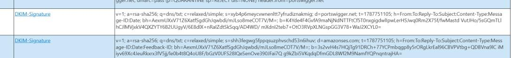
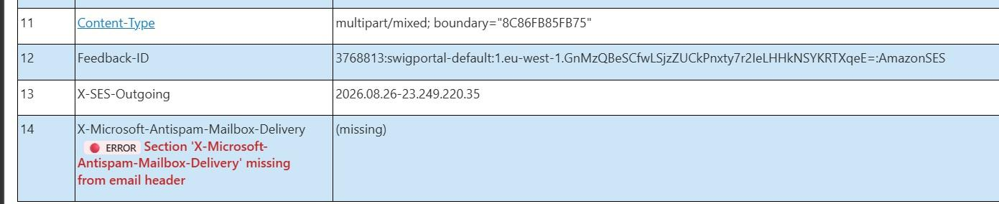

# 📧 Email Header Analysis: Detect Email Spoofing & Phishing

> **Experiment 4** | Digital Forensics Lab  
> *Analyze email headers to detect spoofing, phishing, and authenticate senders using MHA*

---

## 📋 Table of Contents
- [🎯 Overview](#overview)
- [📥 Access Email Headers](#access-email-headers)
- [🔍 Extract Key Header Fields](#extract-key-header-fields)
- [📡 Analyze Received Fields](#analyze-received-fields)
- [🔐 SPF, DKIM & DMARC Authentication](#spf-dkim--dmarc-authentication)
- [⚠️ Red Flags & Anomalies](#red-flags--anomalies)
- [🛠️ Online Analysis Tools](#online-analysis-tools)
- [✅ Best Practices](#best-practices-checklist)
- [📚 References](#references)

---

## 🎯 Overview


Email headers contain critical metadata about an email's journey from sender to recipient. By analyzing these headers, you can detect:
- ✉️ **Email Spoofing** - Forged sender addresses
- 🎣 **Phishing Attacks** - Malicious credential harvesting
- 🔀 **Domain Mismatches** - Authentication failures
- 🌍 **Geographic Anomalies** - Suspicious server locations

---

## 📥 Access Email Headers

### Gmail

1. Open the email
2. Click **⋯** (More) in the upper right corner
3. Select **"Show original"**



---

### Outlook

1. Open the email
2. Click **File** → **Properties**
3. Find the **"Internet headers"** box
4. Copy all text



---

### Yahoo

1. Open the email
2. Click **⋯** (More)
3. Select **"View raw message"**



---

## 🔍 Extract Key Header Fields

Once you access the header, identify these critical fields:

| Field | Description | What to Check |
|-------|-------------|---|
| **From** | Sender's email address | Does domain match Reply-To? |
| **To** | Recipient's email address | Is it you? |
| **Date** | Email sent timestamp | Is timing reasonable? |
| **Subject** | Email subject line | Does it match content? |
| **Return-Path** | Bounce address | Should match From domain |
| **Message-ID** | Unique identifier | Domain should match sender |
| **Received** | Server chain | Most critical for tracing |
| **SPF/DKIM/DMARC** | Authentication results | Pass or Fail? |

### Example Header Analysis


---

## 📡 Analyze Received Fields


The **Received** field shows the email's path. **Read from bottom to top** (sender → recipient):

```
Received: from sender.mail.com (IP: 203.0.113.45) 
          by recipient.mail.com (IP: 192.0.2.1)
          on Wed, 26 Aug 2026 15:30:45 +0000
```

### Key Information Per Received Line:
- 🖥️ **Sending server hostname/IP**
- 🖥️ **Receiving server hostname/IP**
- 🕐 **Timestamp of receipt**

### Red Flags:
- ⚠️ Reverse timestamp progression (backward times = manipulation)
- ⚠️ Single hop (no intermediate servers = suspicious)
- ⚠️ Mismatched IPs (doesn't correspond to mail servers)



---

## 🔐 SPF, DKIM & DMARC Authentication

### SPF (Sender Policy Framework)

**Purpose:** Verifies the sender's IP is authorized to send emails for the domain.

| Status | Meaning | Action |
|--------|---------|--------|
| **PASS** ✅ | IP authorized for domain | Likely legitimate |
| **FAIL** ❌ | IP NOT authorized | Possible spoofing |
| **SOFTFAIL** ⚠️ | Weak fail | Check other indicators |
| **NONE** ❓ | No SPF policy | Higher risk |

---

### DKIM (DomainKeys Identified Mail)

**Purpose:** Verifies email content hasn't been altered in transit.

| Status | Meaning | Action |
|--------|---------|--------|
| **PASS** ✅ | Signature valid, content unaltered | Email intact |
| **FAIL** ❌ | Signature invalid or missing | Content may be tampered |
| **NEUTRAL** ❓ | No signature present | Check SPF/DMARC |



---

### DMARC (Domain-based Message Authentication)

**Purpose:** Combines SPF & DKIM; specifies how to handle failures.

| Status | Meaning | Action |
|--------|---------|--------|
| **PASS** ✅ | Aligned with SPF/DKIM policies | Authenticated sender |
| **FAIL** ❌ | Misaligned or failed | Likely malicious |
| **QUARANTINE** ⚠️ | Policy: send to spam | Suspicious but not blocked |

---

## ⚠️ Red Flags & Anomalies

### Domain Mismatches ❌

Check these combinations match:
- **From domain** ↔️ **Return-Path domain**
- **From domain** ↔️ **Message-ID domain**
- **From domain** ↔️ **Received server domains**

**Example Red Flag:**
```
From: admin@company.com
Return-Path: support@suspicious-site.ru  ← MISMATCH!
```

---

### Suspicious IP Addresses 🌐

Use WHOIS lookup to verify IP ownership:



**Warning Signs:**
- ⚠️ IP from unexpected country
- ⚠️ Residential IP (not datacenter)
- ⚠️ Known spam/phishing ASN
- ⚠️ IP doesn't match domain registrant

---

### Time Discrepancies 🕐

Look for unreasonable delays or backward progression:
```
Received: from mail1.com at 15:30:00
Received: from mail2.com at 15:20:00  ← GOES BACKWARD!
Received: from mail3.com at 19:00:00  ← 3.5 hour gap?
```

---

## 🛠️ Online Analysis Tools

### MXToolbox
**URL:** https://mxtoolbox.com/emailheader/

- Paste full email header
- Automatic SPF/DKIM/DMARC verification
- IP reputation lookup
- Trace server chain



---

### Google G Suite Toolbox
**URL:** https://toolbox.googleapps.com/apps/checkmx/

- Email header analyzer
- SPF record check
- DKIM signature verification
- Delivery trace analysis

---

### AbuseIPDB
**URL:** https://www.abuseipdb.com/

- Check IP reputation
- View abuse history
- Community reports
- Blacklist status



---

## ✅ Best Practices Checklist

- [ ] **Always extract full header** - Don't just look at basic email info
- [ ] **Check all authentication** - Verify SPF, DKIM, DMARC results
- [ ] **Trace received path** - Follow email from sender to recipient
- [ ] **Look for domain matches** - From, Return-Path, Message-ID should align
- [ ] **Verify IP ownership** - Use WHOIS for suspicious addresses
- [ ] **Check timestamps** - Ensure logical time progression
- [ ] **Document findings** - Screenshot results for evidence
- [ ] **Report suspicious emails** - Notify IT/security team immediately
- [ ] **Never click links** - Don't open attachments from spoofed emails
- [ ] **Update spam filters** - Add detected phishing domains to blocklist

---

## 📚 References

- 🔗 [RFC 5322 - Internet Message Format](https://tools.ietf.org/html/rfc5322)
- 🔗 [SPF Record Syntax](https://tools.ietf.org/html/rfc7208)
- 🔗 [DKIM Specification](https://tools.ietf.org/html/rfc6376)
- 🔗 [DMARC Overview](https://dmarc.org/)
- 🔗 [MXToolbox Email Header Analyzer](https://mxtoolbox.com/emailheader/)
- 📖 [NIST Guidelines - Email Security](https://csrc.nist.gov/publications)

---

<div align="center">

**📌 Last Updated:** August 27, 2026  
**👨‍💻 Experiment 4 - Digital Forensics Lab**

</div>
