# 🔎 Autopsy: Forensic Case Creation & Evidence Analysis

> **Experiment 5** | Digital Forensics Lab  
> *Create forensic cases in Autopsy, import split E01 disk images, process evidence, and generate comprehensive forensic reports*

---

## 📋 Table of Contents
- [🎯 Overview](#overview)
- [📋 Requirements](#requirements)
- [📝 Step 1: Create New Case](#step-1-create-new-case)
- [📂 Step 2: Add Evidence Source](#step-2-add-evidence-source)
- [⚙️ Step 3: Configure Ingest Modules](#step-3-configure-ingest-modules)
- [🔄 Step 4: Process Evidence](#step-4-process-evidence)
- [🔍 Step 5: Examine Results](#step-5-examine-results)
- [📊 Step 6: Generate Report](#step-6-generate-report)
- [✅ Best Practices](#best-practices-checklist)
- [📚 References](#references)

---

## 🎯 Overview


Autopsy is an open-source digital forensics platform that:
- 💾 Processes disk images (E01, raw, VMDK, etc.)
- 🔍 Extracts file metadata and deleted files
- 📊 Identifies data artifacts (emails, web activity, etc.)
- 🎯 Performs keyword searches and file type analysis
- 📄 Generates professional forensic reports

**Key Features:**
- ✅ Handles split evidence files (E01 + E02 segments)
- ✅ Ingest modules for automated analysis
- ✅ Hash-based file filtering
- ✅ Timeline reconstruction
- ✅ HTML/PDF report generation

---

## 📋 Requirements

| Item | Details |
|------|---------|
| **Software** | Autopsy 4.21.0 |
| **Evidence Files** | 4Dell Latitude CPi.E01 + E02 (split image) |
| **Evidence Type** | Disk Image (E01 format) |
| **Case Type** | Single-user |
| **Time Zone** | GMT+05:30 (Asia/Calcutta) |
| **Sector Size** | Auto Detect |

---

## 📝 Step 1: Create New Case

### Launch Autopsy

Open Autopsy 4.21.0 - you'll see the Welcome dialog:

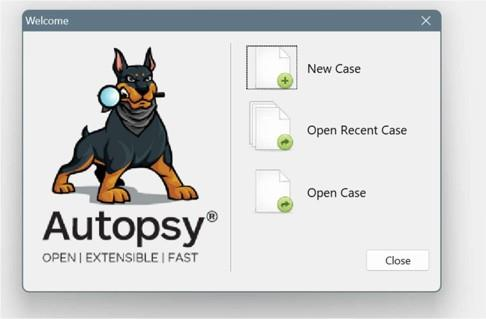

---

### Click "New Case"

Fill in case information:

```
Case Name:      EX05_NIRANJANU
Case Number:    01
Examiner:       NIRANJANU
Case Type:      Single-User
Base Directory: D:\3\1\Digital Forensics\EXP-5
```

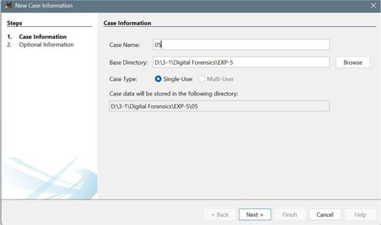

---

### Case Storage

The case is stored in your designated directory with all investigation data:
- 📁 Case metadata
- 📁 Database files
- 📁 Reports directory
- 📁 Evidence storage

Click **Next >** to proceed.

---

## 📂 Step 2: Add Evidence Source

### Select Data Source Type


From the "Add Data Source" dialog, choose:

```
Disk Image or VM File
```

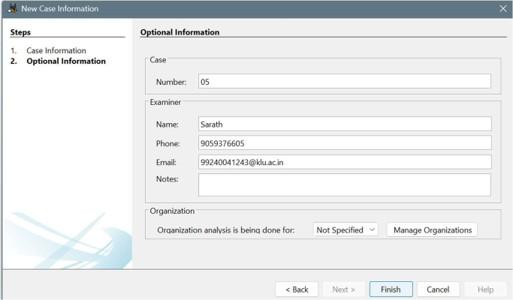

---

### Specify Evidence Path

Set the following parameters:

| Parameter | Value |
|-----------|-------|
| **Evidence Path** | `D:\n\df\Evidence\4Dell Latitude CPi.E01` |
| **Time Zone** | GMT+5:30 (Asia/Calcutta) |
| **Sector Size** | Auto Detect |
| **Ignore Orphan Files** | Unchecked (default) |

> 📌 **Important:** E01 file is the first segment. E02 must be in the same directory.

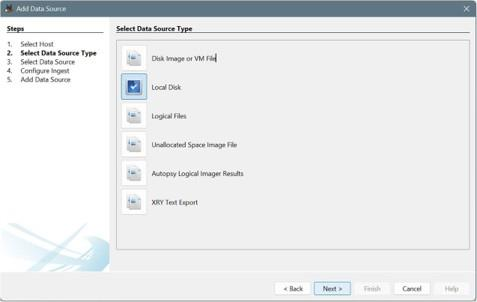

---

### Associated Segments

The E02 file is automatically detected:
```
✅ 4Dell Latitude CPi.E02 located in evidence directory
```

This split image will be processed as a single logical unit.

---

## ⚙️ Step 3: Configure Ingest Modules

### Ingest Module Selection


Select modules to automatically process the evidence:

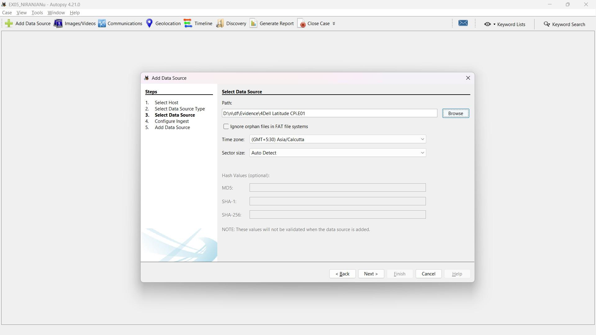

---

### Selected Modules

| Module | Purpose |
|--------|---------|
| **Recent Activity** | Browser history, recent files, memory dumps |
| **Hash Lookup** | Compare files against known bad/good hashes |
| **File Type Identification** | Detect file types by magic bytes |
| **Extension Mismatch Detector** | Find files with wrong extensions |
| **Embedded File Extractor** | Extract files from archives, documents |
| **Picture Analyzer** | Extract and analyze image metadata |
| **Keyword Search** | Search for specific strings in files |
| **E-mail Parser** | Extract emails and attachments |
| **Encryption Detection** | Identify encrypted files/containers |
| **Interesting Files Identifier** | Flag suspicious/important files |

> 💡 These run automatically after adding the data source.

---

## 🔄 Step 4: Process Evidence

### Add Data Source & Start Processing

Click **Add Data Source** to begin:

1. ✅ Data source added to case database
2. ✅ Files indexed and analyzed
3. ✅ Progress panel displays real-time status

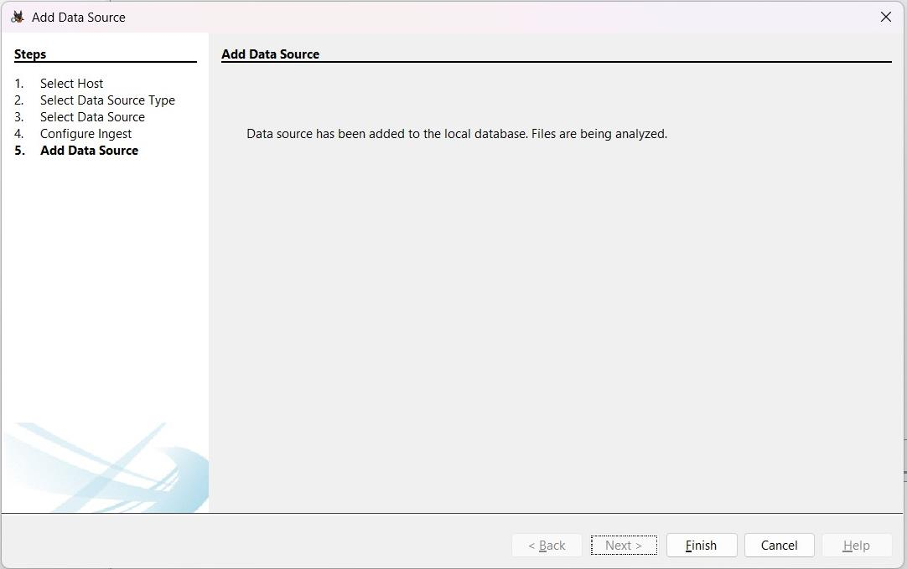

---

### What's Being Processed

During analysis, Autopsy:
- 📂 Reads all files from the image
- 🔍 Extracts metadata (timestamps, hashes, etc.)
- 🗑️ Identifies deleted file entries
- 📧 Parses emails and communications
- 🌐 Extracts web activity
- 🖼️ Analyzes image thumbnails
- 🔎 Performs keyword searches

> ⏱️ Processing time depends on image size (large images may take hours)

---

## 🔍 Step 5: Examine Results

### Autopsy Tree View

After processing completes, browse the results:

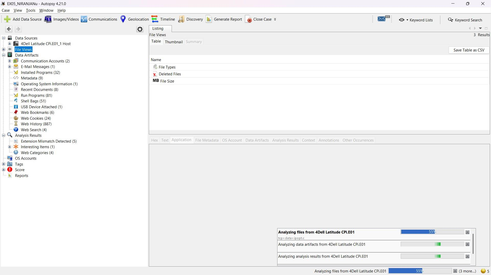

---

### Categories Available

| Category | Examples |
|----------|----------|
| **File Types** | Images, Videos, Audio, Archives, Documents, Databases |
| **Deleted Files** | Recovered deleted file entries |
| **File Size** | Sorted by size (useful for finding hidden data) |
| **Data Artifacts** | Emails, accounts, programs, devices |
| **Operating System** | OS info, users, installed programs |
| **Recent Documents** | Recently accessed files |
| **Run Programs** | Execution history |
| **USB Devices** | External storage history |
| **Web Activity** | Bookmarks, cookies, history, searches |
| **Analysis Results** | Keyword matches, encryption detected |

---

### File Metadata Display

Select a file to view complete metadata:

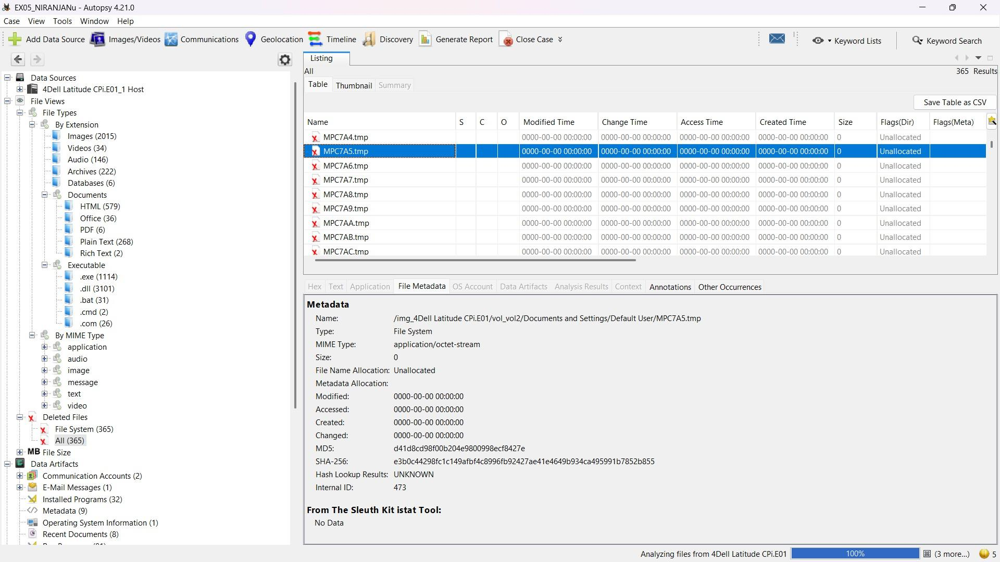

---

### Metadata Included

```
Name:               Img_4Dell Latitude CPi.001.vxd
Type:               JPEG Image
Size:               0 bytes
File Allocation:    Unallocated
Created:            0000-00-00 00:00:00
Modified:           0000-00-00 00:00:00
Access Time:        0000-00-00 00:00:00
Change Time:        0000-00-00 00:00:00
MD5 Hash:           e70e428e5c1a645c8b16858fb2f2b6c0
SHA-256 Hash:       (full hash displayed)
Hash Lookup:        (known/unknown status)
```

---

### Image Preview

Images are displayed in the preview pane with full metadata.

---

## 📊 Step 6: Generate Report

### Access Report Generator

Click **Generate Report** from the menu:

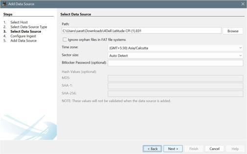

---

### Report Configuration

#### Select Report Modules

Choose which analysis modules to include:

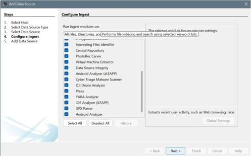

**Available Modules:**
- ✅ Interesting Files Identifier
- ✅ Central Repository
- ✅ PhotoRec Carver
- ✅ Virtual Machine Extractor
- ✅ Data Source Integrity
- ✅ Android Analyzer
- ✅ Cyber Triage Malware Scanner
- ✅ File Carving & Recovery
- ✅ Timeline Analysis
- ✅ Advanced artifact extraction

---

#### Choose Report Format

```
Format Options:
- HTML (interactive, browser-viewable)
- PDF (printable, portable)
```

---

### Report Generation Progress

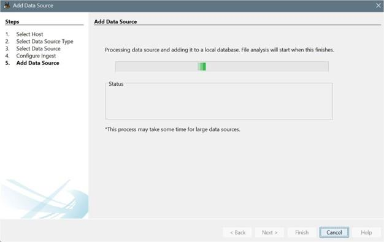

Status updates show:
- Files analyzed
- Artifacts extracted
- Report modules running

> ⏱️ Report generation time depends on evidence size and modules selected

---

### Generated Report Preview

Once complete, view your forensic report:

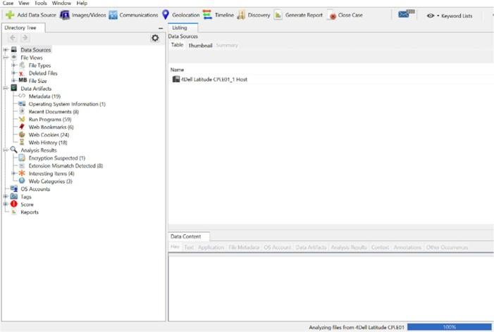

---

### Report Contents

The HTML/PDF report includes:

| Section | Details |
|---------|---------|
| **Case Summary** | Case name, examiner, case number, timestamps |
| **Image Information** | Image path, file system, time zone |
| **File Analysis** | File types, counts, categorization |
| **Deleted Files** | Unallocated space analysis |
| **Artifacts** | Emails, web history, installed programs |
| **System Information** | OS details, user accounts |
| **Analysis Results** | Keyword matches, encryption detection |
| **Timeline** | Events in chronological order |

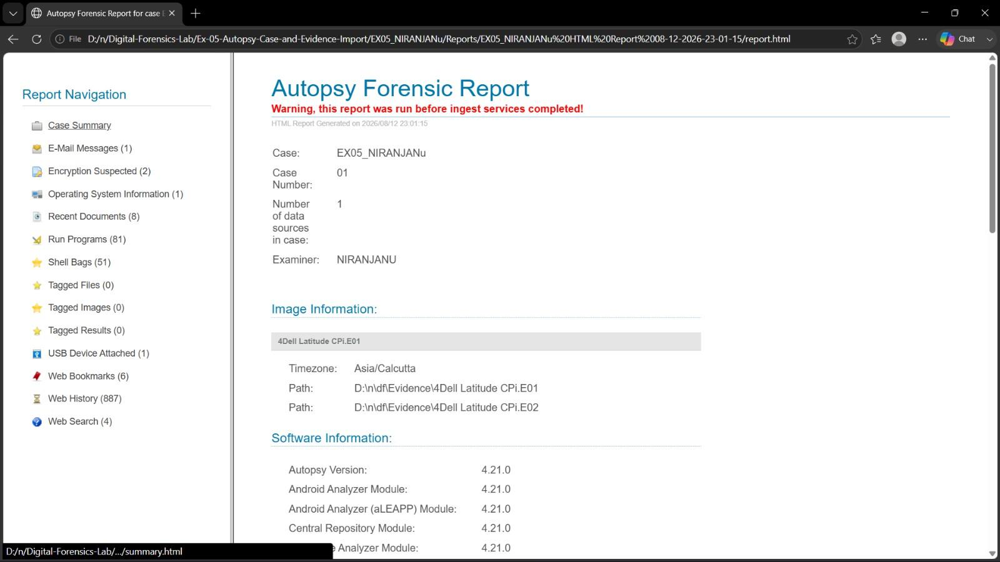

---

## ✅ Best Practices Checklist

- [ ] **Use write-blocker** for physical device acquisition
- [ ] **Document evidence chain** - Who collected, when, where
- [ ] **Set correct time zone** - Affects timestamp interpretation
- [ ] **Run all relevant ingest modules** - Don't skip analysis steps
- [ ] **Review hash results** - Identify known malicious/clean files
- [ ] **Export findings** - Save reports in multiple formats
- [ ] **Archive case directory** - Preserve complete investigation
- [ ] **Backup evidence copies** - Multiple storage locations
- [ ] **Regenerate reports** - After ingest completes (not during)
- [ ] **Verify hash values** - Ensure E01 integrity before analysis
- [ ] **Document findings** - Detailed notes for each artifact
- [ ] **Maintain confidentiality** - Secure case storage and reports

---

## ⚠️ Important Notes

### Report Warnings

If you see:
```
⚠️ Warning: This report was run before ingest services completed!
```

**Action:** Regenerate the report after ingest finishes to get complete results.

---

### E01 Image Integrity

Always verify:
- ✅ Both E01 and E02 files present
- ✅ E02 in same directory as E01
- ✅ Hash values match after import
- ✅ No corruption during evidence handling

---

## 📚 References

- 🔗 [Autopsy Official Website](https://www.autopsy.com/)
- 📖 [Autopsy Documentation](https://sleuthkit.org/autopsy/)
- 📖 [EnCase E01 Format Specification](https://en.wikipedia.org/wiki/Forensic_image)
- 🔗 [The Sleuth Kit (TSK) Documentation](https://www.sleuthkit.org/sleuthkit/docs.php)
- 📘 [NIST Digital Forensics Standards](https://csrc.nist.gov/projects/computer-forensics)
- 📘 [SANS Digital Forensics Resources](https://www.sans.org/cyber-aces/)

---

<div align="center">

**📌 Last Updated:** August 27, 2026  
**👨‍💻 Experiment 5 - Digital Forensics Lab**

</div>
